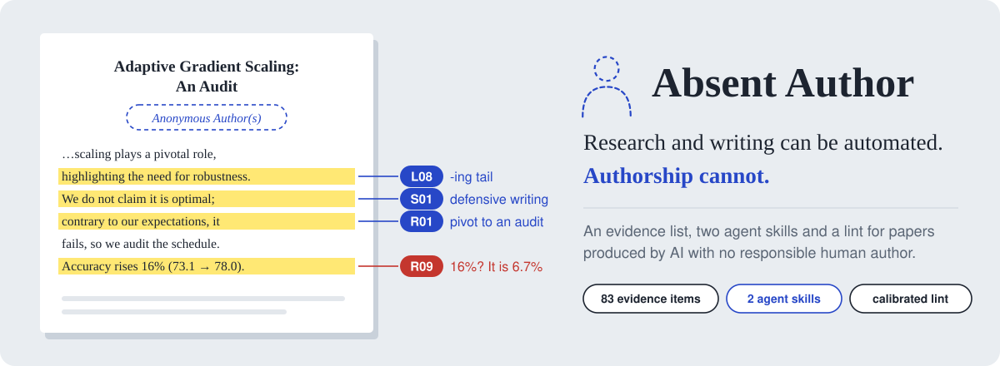
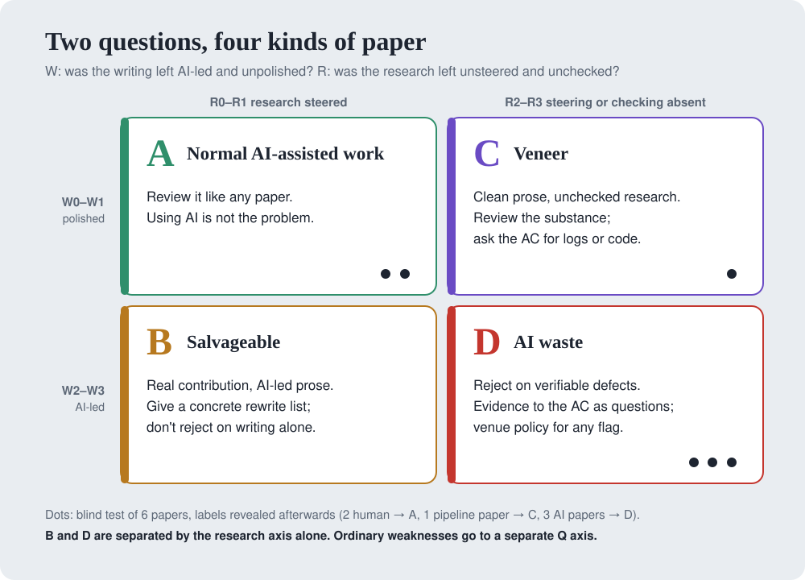
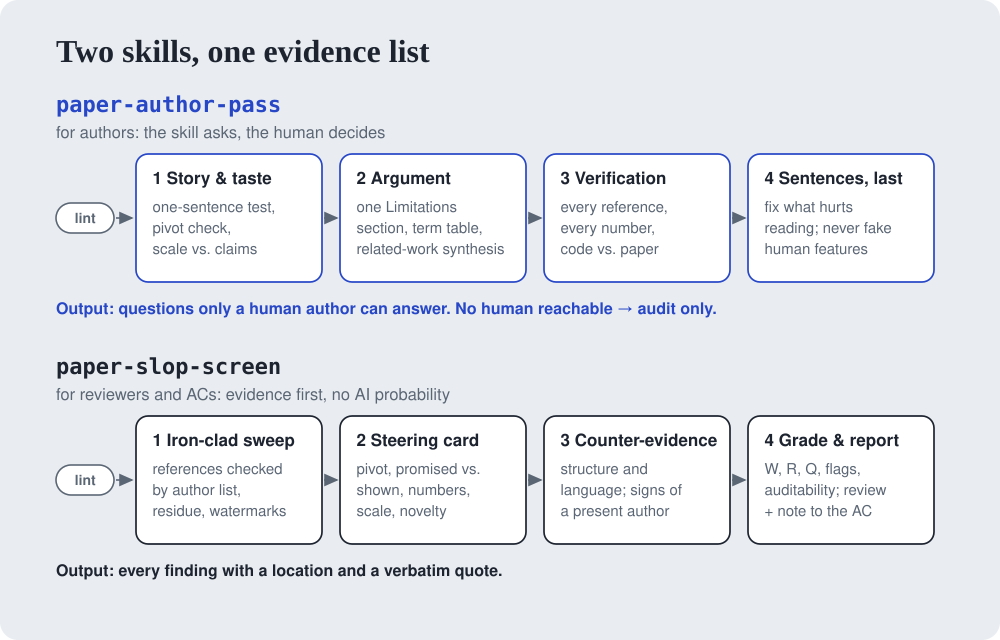
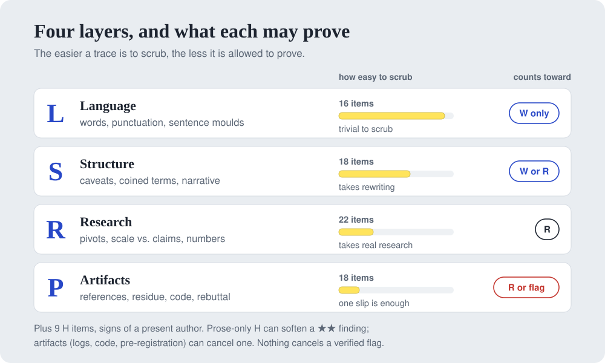
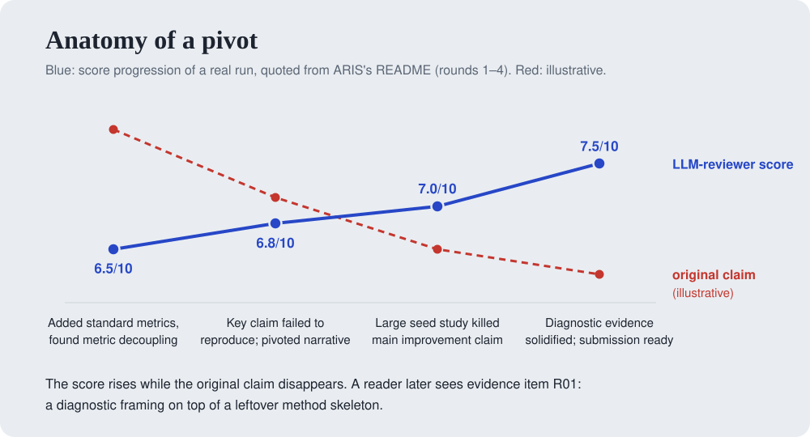
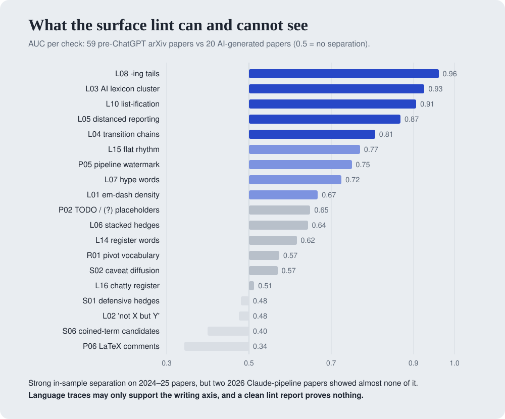

<p align="center"><picture><source media="(prefers-color-scheme: dark)" srcset="assets/banner_dark.svg"></picture></p>

<p align="center"><b>An evidence list and two agent skills for spotting research papers that AI produced and no human stood behind.</b></p>

<p align="center">
  <a href="https://THUROI0787.github.io/absent-author/"></a>
  <a href="EVIDENCE.md"></a>
  <a href="#two-skills"></a>
  <a href="tools/calibration/calibration_report.md"></a>
  <a href="https://doi.org/10.5281/zenodo.23165721"></a>
  <a href="LICENSE"></a>
</p>

<p align="center"><b>Ruoyu Zhao</b><sup>1,*,†</sup> · <b>Zhehao Zou</b><sup>2,*</sup> · <b>Jinheng Zhang</b><sup>3</sup> · <b>Yuting Chen</b><sup>4</sup> · <b>Jiaqi Wu</b><sup>1</sup> · <b>Chenyu Zhu</b><sup>1</sup><br><sup>1</sup>City University of Hong Kong · <sup>2</sup>The Chinese University of Hong Kong · <sup>3</sup>University of Pennsylvania · <sup>4</sup>Georgia Institute of Technology<br><sub>* Equal contribution · † Project lead</sub></p>

<p align="center"><b>English</b> · <a href="README_CN.md">中文</a> · <a href="README_JA.md">日本語</a> · <a href="https://THUROI0787.github.io/absent-author/">Website</a></p>

Reviewers now see papers that an agent produced end to end, with no human who steered, checked or owns them. This repository names the signs of that absence, with sources, and provides tools that turn them into evidence a reviewer can cite and an author can fix.

| You are | Use | You get |
|---|---|---|
| an **author** finishing an AI-assisted paper | [`paper-author-pass`](skills/paper-author-pass/SKILL.md) | questions only you can answer, a claim–evidence map, verified references and numbers, then lighter prose; it ends with three questions to answer before you sign |
| a **reviewer or AC** facing a suspicious submission | [`paper-slop-screen`](skills/paper-slop-screen/SKILL.md) | W / R / Q grades, a quadrant, every finding with a location and a quote, a review paragraph and a note to the AC |
| anyone who wants a **quick surface scan** | [`tools/slop_lint.py`](tools/slop_lint.py) | calibrated counts of 28 surface traces, as candidates for a human to read |
| a **maintainer of review norms** | [`EVIDENCE.md`](EVIDENCE.md) | 83 sourced items with strengths, false-positive notes and paper-type exemptions |

## Quick start

```bash
git clone https://github.com/THUROI0787/absent-author.git && cd absent-author
./install.sh                # both skills -> ~/.claude/skills  (or --project, --codex, --dest DIR, --link)
```

Then, in Claude Code, Codex or any agent that reads `SKILL.md`:

```text
Use paper-author-pass on paper/ in audit mode. I'll answer your questions.
Use paper-slop-screen to triage this arXiv preprint: <path or id>
```

The lint also runs on its own (Python 3.9+, no dependencies), and three helpers do the slow verification work:

```bash
python tools/slop_lint.py paper/ --source -o lint.md       # surface traces; skips prompt dumps and checklists
python tools/ref_verify.py refs.bib --sample 5 --mailto you@example.org   # every author, incl. the last
python tools/number_ledger.py paper/main.tex                # same quantity stated with different values
python tools/pdf_hidden_text.py paper.pdf                   # hidden or remapped text (pip install pymupdf)
```

All four report candidates for a person to read, never verdicts. Optional system tools: `poppler-utils` (pdftotext, pdftoppm) and `tesseract` (OCR check for remapped text).

> [!IMPORTANT]
> Before you run the screen on a submission **under review**, check your venue's reviewer LLM policy. ICML 2026 desk-rejected 497 papers linked to reviewers who broke the no-LLM policy they had chosen. The skill asks you to confirm this first.

## What you get

<details open>
<summary><b>The lint</b> on a synthetic AI-style paper (<code>tools/fixtures/synthetic_slop</code>)</summary>

```text
- L-layer cluster: 5 of 6 L-cluster checks are above the human p90 (L03, L04, L05, L08, L10).
  In calibration, 0% of human papers and 50% of AI-heavy papers reached at least this many.
  Writing-polish signal only; 2026 Claude-based pipeline papers scored 0-1 here.

| ID  | Check                                  | Count | per 1k | Band | Human p50 / p90 / p99 | AUC   |
| L03 | AI-associated lexicon cluster          | 20    | 46     | high | 0.604 / 1.78 / 5.92   | 0.927 |
| L08 | Trailing -ing clauses                  | 3     | 6.9    | high | 0 / 0.202 / 0.809     | 0.961 |
| S01 | Defensive pre-emptive hedging          | 6     | 13.8   | high | 0 / 0 / 0.485         | rare  |
| S03 | Instruction / revision leakage         | 6     | 13.8   | high | 0 / 0 / 0             | rare  |
| P05 | Pipeline watermark / signature         | 4     | 9.2    | high | 0 / 0 / 0             | 0.75  |
```
Every hit comes with a file, a line and a snippet. Hits are candidates; a clean report proves nothing. For what it is worth, this README scores 1 of 6 on the same cluster, with zero em dashes.
</details>

<details>
<summary><b>The screen</b>: excerpt of a report on a 2026 pipeline paper (blind test, quadrant C)</summary>

```text
Writing (W)  W1   clean, field-idiomatic prose; L-cluster 1/5; em dashes 6.3 per 1k words
Research (R) R3   R09 confirmed in three forms; R10; R15
Flags        2    P03: ref [13] cites "arXiv:2409.XXXXX" and cannot be found
                  R09: one configuration is 63.4 CIDEr in Tables III, IX, X and 57.2 in Table V
Quadrant     C    veneer: clean prose, unchecked research

Evidence
R09 ★★★ §III-B  "we retain 2,077 pairs"      0.85 × 2,524 = 2,145, not 2,077
R09 ★★★ §VI-B   "12.4% of test pairs"        12.4% of 207 = 25.7, not a whole number

Review-ready paragraph: substance only, no claims about provenance.
Note to the AC: questions the authors can answer (reconcile Table V with Tables III/IX/X; provide ref [13]).
```
Six worked examples, including the hardest call: [`worked-examples.md`](skills/paper-slop-screen/references/worked-examples.md).
</details>

## Why this exists

- ICLR 2026: Pangram estimated that 21% of reviews were fully AI-generated and about 9% of submissions were more than half AI text; every paper with a confirmed hallucinated reference was desk-rejected. [[Pangram]](https://www.pangram.com/blog/pangram-predicts-21-of-iclr-reviews-are-ai-generated) [[ICLR]](https://blog.iclr.cc/2026/03/31/a-retrospective-on-the-iclr-2026-review-process/)
- COLM 2026 named the new genres: *theoryslop* and *slopterpretability*. The ICLR 2027 chairs warn about "paper-shaped objects" and note that current AI systems "seem to have poor taste in research questions". [[COLM]](https://gregdurrett.github.io/colm2026-blog/ai-papers.html) [[ICLR 2027]](https://blog.iclr.cc/2026/09/02/submission-policies-for-iclr-2027/)
- TMLR's desk-rejection rate went from about 6% to about 53%; when editors phoned authors, the authors of three papers could not answer basic questions about their own work. [[TMLR]](https://medium.com/@TmlrOrg/asking-authors-about-their-own-papers-3d2e04e5dee0)
- On social media, reviewers complain about the same symptoms again and again: em-dash floods, defensive writing, coined terms nobody defined, performative "honest disclosure" of failed runs, and method papers that quietly turn into "audits" of a detail once the method stops working.

Reviewers already have intuitions about this. What has been missing is a **shared vocabulary with evidence behind it**: something a reviewer can cite in a review, an AC can act on, and an author can check before submitting. Sources for every claim are in [`docs/SOURCES.md`](docs/SOURCES.md).

## What we detect: an absent author

**Slop outsources the cost of verifying a paper to its reviewers.** An author can be absent in three ways:

| Absence | What it looks like | Layer |
|---|---|---|
| **Nobody polished it** | The writing is AI-led and unowned: dash floods, "not X but Y", defensive caveats, coined terms, performative honesty | L, some S |
| **Nobody steered it** | No human judged which question was worth asking or what to do when the plan failed: pivots into audit papers, theoryslop, toy scale with grand claims | R, some S |
| **Nobody checked it** | The final artifact was never verified: fabricated references, chatbot residue, numbers that disagree between text and table, promised but missing analyses | P, R |

Two questions place a paper in one of four quadrants. Ordinary weaknesses go to a separate quality axis (Q), so a weak human paper is never called slop.

<p align="center"><picture><source media="(prefers-color-scheme: dark)" srcset="assets/quadrant_dark.svg"></picture></p>

**B (salvageable)** and **D (AI waste)** are separated by the research axis alone. B gets a concrete rewrite list and is not rejected for its prose alone. D gets a reject-level review based only on defects anyone can verify, and a confidential evidence table for the AC written as questions the authors can answer. See [`docs/POSITIONING.md`](docs/POSITIONING.md) for the full reasoning, including why disclosed AI involvement may soon count in a paper's favour.

## Two skills

<p align="center"><picture><source media="(prefers-color-scheme: dark)" srcset="assets/workflow_dark.svg"></picture></p>

| | [`paper-author-pass`](skills/paper-author-pass/SKILL.md) | [`paper-slop-screen`](skills/paper-slop-screen/SKILL.md) |
|---|---|---|
| **For** | authors, before submission | reviewers, ACs, co-authors |
| **Principle** | the skill asks, the human decides | evidence first, no AI probability |
| **Order** | story and taste → argument → verification → sentences → author's checkpoint | iron-clad sweep → steering card → structure, language, counter-evidence → grade |
| **Output** | author decision questions, claim–evidence map, change log, a draft AI contribution statement, and an author's checkpoint (understand / defend / sign) | W / R / Q grades, flags, auditability, quadrant, a substance-only review paragraph, a note to the AC |
| **Hard rule** | no human reachable → audit only; never answers its own questions or polishes an unsteered paper (that would only turn a D into a C) | never writes "AI-generated" in a public review; language evidence never raises the research grade |

Both skills read the same catalog (`references/evidence-catalog.md`, synced from [`EVIDENCE.md`](EVIDENCE.md)) and ship the lint as `scripts/slop_lint.py`.

## The evidence list

[`EVIDENCE.md`](EVIDENCE.md) (English) and [`EVIDENCE_CN.md`](EVIDENCE_CN.md) (Chinese master) hold **74 items in four layers plus nine signs of a present author** (83 IDs in all). Every item has a strength, the axis it may count toward, a note on how honest humans trip it, and its sources. It opens with a 15-minute quick card for reviewers and ends with paper-type exemptions (negative-result, theory, benchmark, position, survey, systems papers) and the grading rules.

<p align="center"><picture><source media="(prefers-color-scheme: dark)" srcset="assets/layers_dark.svg"></picture></p>

A taste of the strongest items (★ weak · ★★ moderate · ★★★ strong · ☠ disqualifying once verified):

| ID | Evidence | Strength |
|---|---|---|
| R01 | A failed method relabelled as an "audit / diagnostic" paper, with the method skeleton still inside | ★★★ |
| R07 | Analyses promised in the text and never shown ("reliability diagrams confirm…", no diagram) | ★★★ |
| R09 | Numbers that drift between sections; "+16%" that is really 6.7% | ★★★ |
| S02 | "Confession letter" caveats in every section, placed exactly where a reviewer would attack | ★★ |
| S06 | Coined terms that fail the replacement test | ★★ |
| P03 | A reference whose author list was invented, or an arXiv ID like `2409.XXXXX` | ☠ once verified |
| H06 | Logs, code, version history, a timestamped pre-registration: these can cancel a finding | counter-evidence |

Browse and filter all of them on the [website](https://THUROI0787.github.io/absent-author/#evidence).

## Anatomy of a pivot

<p align="center"><picture><source media="(prefers-color-scheme: dark)" srcset="assets/pivot_dark.svg"></picture></p>

Where do "audit papers" come from? An auto-review loop optimises an LLM reviewer's score, and when a claim fails, re-framing is cheaper than a new experiment. The run above is quoted from the README of [ARIS](https://github.com/wanshuiyin/Auto-claude-code-research-in-sleep) (Auto-Research-In-Sleep), whose maintainers have since diagnosed the "confession letter" style themselves, added anti-over-defence rules ([HERO](https://github.com/wanshuiyin/HERO-Anti-OverDefense)) and released a reviewer-side tool ([Anti-Autoresearch](https://github.com/wanshuiyin/Anti-Autoresearch)). We read twelve open-source auto-research pipelines to derive fingerprints like this one; the notes are in [`docs/research_notes/E_pipeline_fingerprints.md`](docs/research_notes/E_pipeline_fingerprints.md). A pivot a human chose on purpose is fine. A pivot nobody judged is not.

## What we measured

<p align="center"><picture><source media="(prefers-color-scheme: dark)" srcset="assets/calibration_dark.svg"></picture></p>

**Calibration.** 59 randomly sampled pre-ChatGPT arXiv papers against 20 AI-generated ones. Trailing "-ing" clauses (AUC 0.96) and 2024-era AI vocabulary (0.93) separate well; "not X but Y" (0.48) and coined-term candidates (0.40) do not. The sample is small, in-sample and era-confounded. Most importantly, **two 2026 Claude-pipeline papers showed almost none of these traces**. Language evidence may only support the writing axis, and a clean lint report proves nothing. Full report: [`tools/calibration/calibration_report.md`](tools/calibration/calibration_report.md).

**Blind test.** An agent ran the screen skill on six documents; labels were revealed afterwards.

| What it really was | Screen result |
|---|---|
| Human ACL 2018 paper | **A** · W0 R0 |
| Human 2021 paper by non-native authors | **A** · W0 R1 |
| AI Scientist v2 workshop paper (disclosed) | **D** · W2 R3 |
| AI Scientist v1 example paper (disclosed) | **D** · W2 R3 · 3 flags |
| 2026 autonomous-agent paper, agent use disclosed | **D** · W3 R3 |
| 2026 full auto-research pipeline paper | **C** · W1 R3 · 2 flags |

The two 2026 papers were caught by arithmetic: the same configuration scoring 63.4 in one table and 57.2 in another, "12.4% of 207" (not a whole number), a reference with arXiv ID `2409.XXXXX`. Worked examples: [`skills/paper-slop-screen/references/worked-examples.md`](skills/paper-slop-screen/references/worked-examples.md).

## What this is not

1. **Not an AI detector.** No probabilities. In a 2023 study, AI detectors flagged about 61% of non-native TOEFL essays as AI-written. [[Liang et al.]](https://arxiv.org/abs/2304.02819)
2. **Language never convicts.** L-layer traces count toward the writing axis only.
3. **Junior is not absent.** First papers and non-native writing trip several items; they count only alongside research or artifact evidence.
4. **Not a public accusation.** Reviews state checkable defects; provenance concerns go to the AC as questions. Not for complaints about colleagues, student discipline, hiring or promotion.
5. **Not a laundering service.** By default the writing skill will not answer its own author questions or polish a paper that no human steered. Anyone can edit a skill; what keeps clean prose from passing is the grading, which never lets language evidence lower the research grade.
6. **Not against AI.** Heavy AI execution with logs, code and a specific AI contribution statement earns an A+ auditability rating.

## Where this is going

**This list can be misused.** Anyone can load it into a writing agent and scrub the surface traces, chatbot residue and pipeline watermarks included; paraphrasing tools already do much of that. We publish it anyway, because clean prose can lower the writing grade but never the research grade. A paper nobody steered or checked moves from D to C at best, and C is where the screen looks hardest: references that exist, numbers that reproduce, design choices someone can explain. No checklist supplies those. We chose not to compete on wording.

**Text proves less and less.** For many papers, writing is no longer the hard part. We expect evaluation to move to what only a present author can supply: disclosed AI use, artifacts others can check (code, logs, formal proofs), and the ability to defend the work in person. Before signing a paper, AI-assisted or not, answer three questions:

> **Do you understand it thoroughly? Would you defend it face to face? Will you put your name behind it?**

The questions are adapted from Chinese-language commentary on the [Harvard CMSA Summit on PhD Math Education in the Age of AI](https://cmsa.fas.harvard.edu/media/2026/09/Summit-on-PhD-Math-Education-in-the-Age-of-AI.pdf) (September 2026); the report itself asks that AI use "accelerate understanding, not bypass understanding". `paper-author-pass` ends every run with three such questions about your paper and does not answer them for you. That is a default, not a lock: the skills are MIT-licensed and anyone can change them. The full argument is in [`docs/POSITIONING.md` §9](docs/POSITIONING.md#9-dual-use-and-the-long-term-view).

## Contributing

Word lists go stale and pipelines learn to scrub. The list stays useful only if reviewers keep feeding it real cases, including the ones where it was wrong.

- **[Propose evidence](https://github.com/THUROI0787/absent-author/issues/new?template=new-evidence.yml)**: a pattern, an anonymised example, and at least one way an honest human could produce it.
- **[File a field report](https://github.com/THUROI0787/absent-author/issues/new?template=field-report.yml)**: an anonymised case from a finished review, and what happened next.
- **[Report a false positive](https://github.com/THUROI0787/absent-author/issues/new?template=false-positive.yml)**: these matter most.

Maintainers: edit `EVIDENCE.md` and `EVIDENCE_CN.md` together, then run `python tools/sync_evidence.py`; CI checks that IDs match everywhere. Details in [`CONTRIBUTING.md`](CONTRIBUTING.md) ([中文](CONTRIBUTING_CN.md)).

<details>
<summary>Repository layout</summary>

```
EVIDENCE.md / EVIDENCE_CN.md   the evidence list (English mirror / Chinese master)
docs/POSITIONING.md            what we detect and why (中文: POSITIONING_CN.md)
docs/SOURCES.md                every source key: link, type, verification status
docs/evidence-index-en.md      one line per evidence ID
docs/research_notes/           raw research: social media (EN/CN), papers, GitHub skills, pipeline fingerprints
docs/field_reports/            anonymised reviewer cases and the false-positive registry
skills/paper-author-pass/      writing-side skill
skills/paper-slop-screen/      review-side skill
tools/slop_lint.py             deterministic surface-trace lint (candidates only)
tools/ref_verify.py            reference checker: multi-source lookup, full author-list comparison
tools/number_ledger.py         quantities stated with different values; arithmetic and table recomputation
tools/pdf_hidden_text.py       invisible, out-of-page or remapped PDF text; venue canary vs. author source
tools/calibration/             corpus IDs, results and the reproduction script
tools/sync_evidence.py         syncs the list into both skills and checks ID coverage
tools/figures/                 regenerates assets/*.svg
tools/build_site_data.py       builds site/data/*.json from the evidence list
site/                          the GitHub Pages website (deployed by .github/workflows/pages.yml)
```
</details>

## Acknowledgements and related work

We thank the authors of the work below. Every source used anywhere in the repository, with its link and verification status, is listed in [`docs/SOURCES.md`](docs/SOURCES.md). Repositories without a license file are quoted or paraphrased, never copied.

**Writing and review skills we learned from.**
- [Master-cai/Research-Paper-Writing-Skills](https://github.com/Master-cai/Research-Paper-Writing-Skills) (MIT), based on Prof. Sida Peng's open writing notes: reverse outlining and the `Claim | Evidence | Status` map used in `paper-author-pass`.
- [wanshuiyin/Anti-Autoresearch](https://github.com/wanshuiyin/Anti-Autoresearch) (MIT): the rule that style impressions carry no verdict weight, and thresholds for defensive hedging. [wanshuiyin/HERO-Anti-OverDefense](https://github.com/wanshuiyin/HERO-Anti-OverDefense): patterns of over-defensive writing.
- [Kiterlin/anti-defensive-writing](https://github.com/Kiterlin/anti-defensive-writing) (MIT) and [lensback940701/Evidence-Bound-Press-Conference-Revision-Skill](https://github.com/lensback940701/Evidence-Bound-Press-Conference-Revision-Skill) (MIT): claim-forward rewriting and the claim-ceiling contract.
- [Orchestra-Research/AI-Research-SKILLs](https://github.com/Orchestra-Research/AI-Research-SKILLs) (MIT): matching evidence type to claim type, and never writing BibTeX from memory. [YSLAB-ai/manuscript-writing](https://github.com/YSLAB-ai/manuscript-writing): weaker claims are not a fix for missing support.
- Sentence-level pattern lists, used as candidates for the L layer: [blader/humanizer](https://github.com/blader/humanizer), [conorbronsdon/avoid-ai-writing](https://github.com/conorbronsdon/avoid-ai-writing), [ashgreat/humanizer](https://github.com/ashgreat/humanizer), [cbsteh/anti-ai-writing](https://github.com/cbsteh/anti-ai-writing), [isatimur/de-slop](https://github.com/isatimur/de-slop), [shreyashankar/plain-writing-skill](https://github.com/shreyashankar/plain-writing-skill), [SyntaxSmith/humanize-paper](https://github.com/SyntaxSmith/humanize-paper), [op7418/humanizer-zh](https://github.com/op7418/humanizer-zh) and [Leey21/awesome-ai-research-writing](https://github.com/Leey21/awesome-ai-research-writing).
- [markrussinovich/refchecker](https://github.com/markrussinovich/refchecker) (MIT): reference checking by author overlap.

**Auto-research pipelines whose open code let us derive fingerprints.** [wanshuiyin/Auto-claude-code-research-in-sleep](https://github.com/wanshuiyin/Auto-claude-code-research-in-sleep) (ARIS), whose maintainers also published the review-loop rules and later fixes that made the pivot mechanism visible; Sakana AI's [SakanaAI/AI-Scientist](https://github.com/SakanaAI/AI-Scientist), [SakanaAI/AI-Scientist-v2](https://github.com/SakanaAI/AI-Scientist-v2) and their [human review of three AI-generated workshop papers](https://github.com/SakanaAI/AI-Scientist-ICLR2025-Workshop-Experiment); [SamuelSchmidgall/AgentLaboratory](https://github.com/SamuelSchmidgall/AgentLaboratory); [HKUDS/AI-Researcher](https://github.com/HKUDS/AI-Researcher); [ResearAI/DeepScientist](https://github.com/ResearAI/DeepScientist); [karpathy/autoresearch](https://github.com/karpathy/autoresearch); [IntologyAI/Zochi](https://github.com/IntologyAI/Zochi). Building in the open is what made this analysis possible.

**Research we rely on.** Liang et al., [GPT detectors are biased against non-native English writers](https://arxiv.org/abs/2304.02819) (*Patterns* 2023); Liang et al., [Mapping the increasing use of LLMs in scientific papers](https://arxiv.org/abs/2404.01268) (COLM 2024) and [Monitoring AI-modified content at scale](https://arxiv.org/abs/2403.07183) (ICML 2024); Kobak et al., [Delving into LLM-assisted writing in biomedical publications](https://doi.org/10.1126/sciadv.adt3813) (*Science Advances* 2025); Juzek & Ward, [Why does ChatGPT "delve" so much?](https://aclanthology.org/2025.coling-main.426) (COLING 2025); Geng & Trotta, [Is ChatGPT transforming academics' writing style?](https://arxiv.org/abs/2404.08627) (Findings of ACL 2025); Tufts et al., [A practical examination of AI-generated text detectors](https://aclanthology.org/2025.findings-naacl.271/) (Findings of NAACL 2025); Hadan et al., [The great AI witch hunt](https://doi.org/10.1016/j.chbah.2024.100095) (2024); Luo et al., [The more you automate, the less you see](https://arxiv.org/abs/2509.08713); Beel et al., [Evaluating Sakana's AI Scientist](https://arxiv.org/abs/2502.14297); Si et al., [The ideation–execution gap](https://arxiv.org/abs/2506.20803); Gupta & Pruthi, [All that glitters is not novel](https://arxiv.org/abs/2502.16487) (ACL 2025); Paech et al., [Antislop](https://arxiv.org/abs/2510.15061); Sakai et al., [HalluCitation matters](https://arxiv.org/abs/2601.18724); Oh et al., [Science or slop?](https://arxiv.org/abs/2610.00531).

**Venue chairs, editors and reviewers who published what they saw.** The ICLR 2026 [response](https://blog.iclr.cc/2025/11/19/iclr-2026-response-to-llm-generated-papers-and-reviews/) and [retrospective](https://blog.iclr.cc/2026/03/31/a-retrospective-on-the-iclr-2026-review-process/), the [ICLR 2027 submission policies](https://blog.iclr.cc/2026/09/02/submission-policies-for-iclr-2027/), the [COLM 2026 program chairs](https://gregdurrett.github.io/colm2026-blog/ai-papers.html), the [NeurIPS 2026 Position Paper Track chairs](https://blog.neurips.cc/2026/06/02/ai-generated-papers-in-the-neurips-2026-position-paper-track/), the [ICML 2026 program chairs](https://blog.icml.cc/2026/03/18/on-violations-of-llm-review-policies/), the [TMLR editors-in-chief](https://medium.com/@TmlrOrg/asking-authors-about-their-own-papers-3d2e04e5dee0), the analyses by [Pangram](https://www.pangram.com/blog/pangram-predicts-21-of-iclr-reviews-are-ai-generated) and [GPTZero](https://gptzero.me/news/neurips/), the [Harvard CMSA Summit on PhD Math Education in the Age of AI](https://cmsa.fas.harvard.edu/aimathphd_summit/), and the many reviewers who wrote about AI slop on blogs, Hacker News, Reddit, Xiaohongshu and Zhihu. Individual posts are cited in [`docs/SOURCES.md`](docs/SOURCES.md).

## Authors, citation and license

| Author | Affiliation | Email |
|---|---|---|
| Ruoyu Zhao (project lead, equal contribution) | City University of Hong Kong | thuroi175007@gmail.com |
| Zhehao Zou (equal contribution) | The Chinese University of Hong Kong | zouzhehao0907@gmail.com |
| Jinheng Zhang | University of Pennsylvania | jinhengz@seas.upenn.edu |
| Yuting Chen | Georgia Institute of Technology | yuting3123@gmail.com |
| Jiaqi Wu | City University of Hong Kong | 3140610478@qq.com |
| Chenyu Zhu | City University of Hong Kong | zcy20050413@gmail.com |

Ruoyu Zhao and Zhehao Zou contributed equally. Ruoyu Zhao leads the project.

Archived on Zenodo: cite the concept DOI [`10.5281/zenodo.23165721`](https://doi.org/10.5281/zenodo.23165721), which always resolves to the latest version. Version 0.4.0 alone is [`10.5281/zenodo.23165722`](https://doi.org/10.5281/zenodo.23165722).

```bibtex
@misc{absentauthor2026,
  title        = {Absent Author: Evidence and Skills for Spotting AI-Produced Papers Without a Responsible Human Author},
  author       = {Zhao, Ruoyu and Zou, Zhehao and Zhang, Jinheng and Chen, Yuting and Wu, Jiaqi and Zhu, Chenyu},
  note         = {Ruoyu Zhao and Zhehao Zou contributed equally. Project lead: Ruoyu Zhao},
  year         = {2026},
  publisher    = {Zenodo},
  doi          = {10.5281/zenodo.23165721},
  url          = {https://doi.org/10.5281/zenodo.23165721},
  howpublished = {\url{https://github.com/THUROI0787/absent-author}}
}
```

MIT licensed. See [`LICENSE`](LICENSE).
