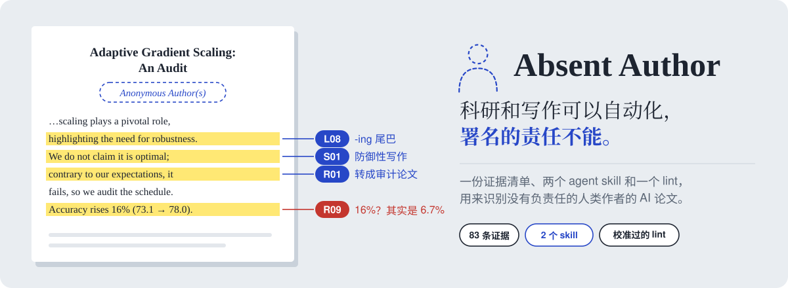
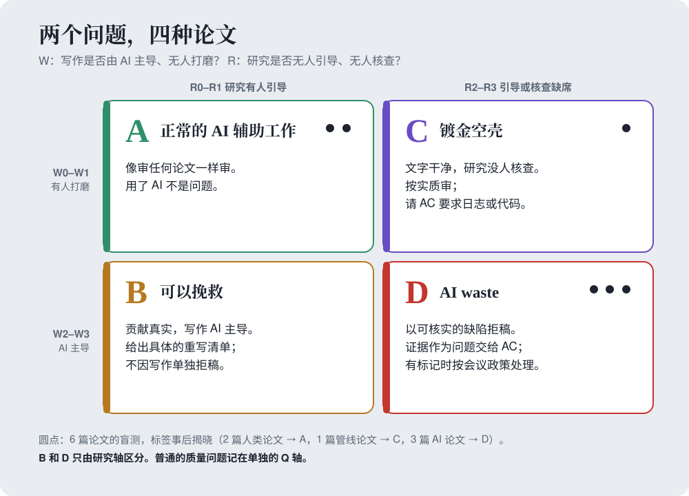
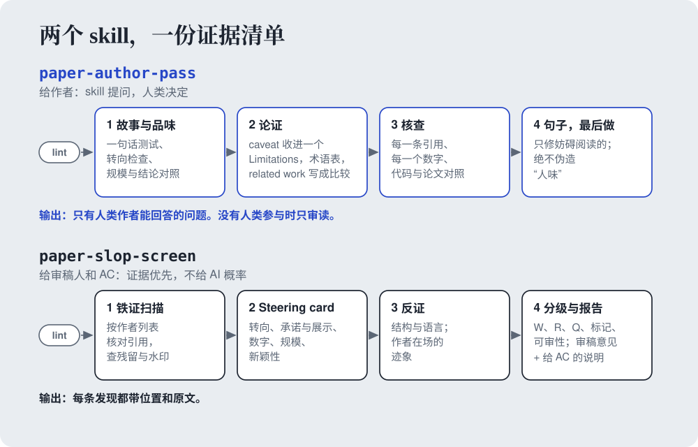
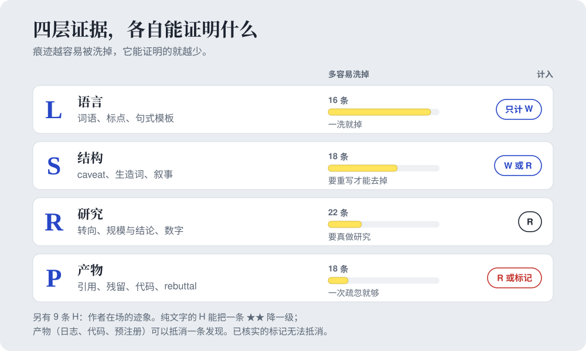
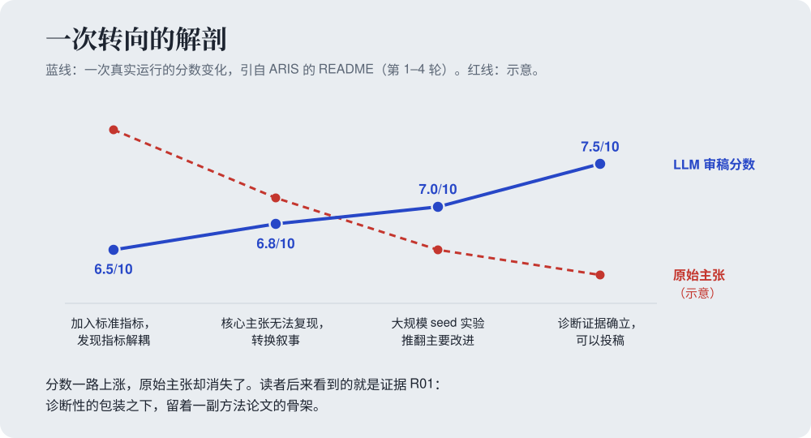
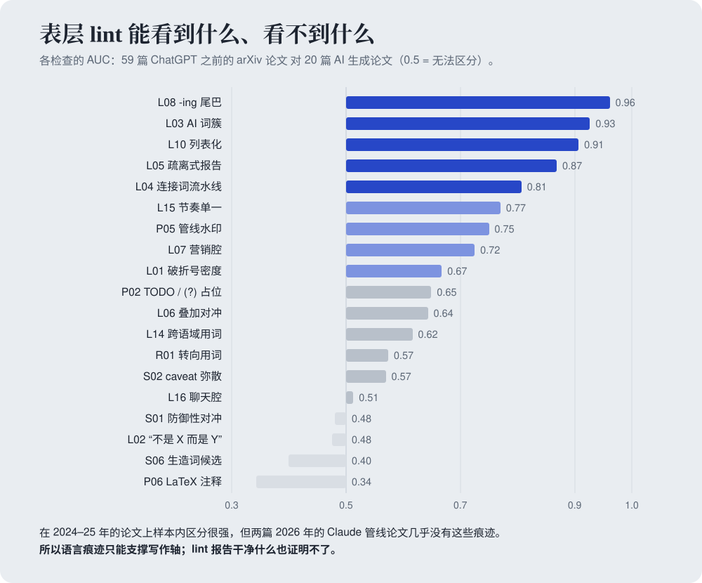

<p align="center"><picture><source media="(prefers-color-scheme: dark)" srcset="assets/banner_cn_dark.svg"></picture></p>

<p align="center"><b>一份证据清单和两个 agent skill，用来识别由 AI 产出、却没有人类为之负责的研究论文。</b></p>

<p align="center">
  <a href="https://THUROI0787.github.io/absent-author/"></a>
  <a href="EVIDENCE_CN.md"></a>
  <a href="#两个-skill"></a>
  <a href="tools/calibration/calibration_report.md"></a>
  <a href="LICENSE"></a>
</p>

<p align="center"><b>Ruoyu Zhao</b><sup>1,*,†</sup> · <b>Zhehao Zou</b><sup>2,*</sup> · <b>Jinheng Zhang</b><sup>3</sup> · <b>Yuting Chen</b><sup>4</sup> · <b>Jiaqi Wu</b><sup>1</sup> · <b>Chenyu Zhu</b><sup>1</sup><br><sup>1</sup>City University of Hong Kong · <sup>2</sup>The Chinese University of Hong Kong · <sup>3</sup>University of Pennsylvania · <sup>4</sup>Georgia Institute of Technology<br><sub>* 共同一作 · † 项目负责人</sub></p>

<p align="center"><a href="README.md">English</a> · <b>中文</b> · <a href="README_JA.md">日本語</a> · <a href="https://THUROI0787.github.io/absent-author/">网站</a></p>

审稿人现在常常读到这样的论文：由 agent 从头到尾产出，却没有人类引导、核查或为之负责。这个仓库为这种"作者缺席"提供一套有来源的共同语言，并把它变成审稿人能引用、作者能修改的证据。

| 你是 | 用 | 得到 |
|---|---|---|
| 正在收尾一篇 AI 辅助论文的**作者** | [`paper-author-pass`](skills/paper-author-pass/SKILL.md) | 只有你能回答的问题、claim–evidence 对照、核实过的引用和数字，最后才是文字打磨；结尾是三个需要你在署名前回答的问题 |
| 面对一篇可疑投稿的**审稿人或 AC** | [`paper-slop-screen`](skills/paper-slop-screen/SKILL.md) | W / R / Q 分级、象限、每条发现的位置和原文、审稿段落和给 AC 的说明 |
| 想快速扫一遍表层痕迹的**任何人** | [`tools/slop_lint.py`](tools/slop_lint.py) | 28 项表层痕迹的校准计数，作为候选交给人去读 |
| 维护审稿规范的**组织者** | [`EVIDENCE_CN.md`](EVIDENCE_CN.md) | 83 条有来源的证据，附强度、误判提醒和论文类型豁免 |

## 快速开始

```bash
git clone https://github.com/THUROI0787/absent-author.git && cd absent-author
./install.sh                # 两个 skill -> ~/.claude/skills（或 --project、--codex、--dest DIR、--link）
```

然后在 Claude Code、Codex 或任何能读 `SKILL.md` 的 agent 里：

```text
用 paper-author-pass 对 paper/ 做一次 audit，我来回答你的问题。
用 paper-slop-screen 对这篇 arXiv 预印本做 triage：<路径或 ID>
```

lint 也可以单独运行（Python 3.9+，无依赖）：

```bash
python tools/slop_lint.py paper/ --source -o lint.md
```

> [!IMPORTANT]
> 对**在审**论文运行筛查之前，请先确认会议的审稿人 LLM 政策。ICML 2026 因审稿人违反自选的禁用 LLM 政策，desk reject 了 497 篇关联投稿。skill 会先请你确认这一点。

## 能得到什么

<details open>
<summary><b>lint</b> 在一篇合成的 AI 风格论文上的输出（<code>tools/fixtures/synthetic_slop</code>）</summary>

```text
- L-layer cluster: 5 of 6 L-cluster checks are above the human p90 (L03, L04, L05, L08, L10).
  In calibration, 0% of human papers and 50% of AI-heavy papers reached at least this many.

| ID  | Check                                  | Count | per 1k | Band | Human p50 / p90 / p99 | AUC   |
| L03 | AI-associated lexicon cluster          | 20    | 46     | high | 0.604 / 1.78 / 5.92   | 0.927 |
| L08 | Trailing -ing clauses                  | 3     | 6.9    | high | 0 / 0.202 / 0.809     | 0.961 |
| S01 | Defensive pre-emptive hedging          | 6     | 13.8   | high | 0 / 0 / 0.485         | rare  |
| S03 | Instruction / revision leakage         | 6     | 13.8   | high | 0 / 0 / 0             | rare  |
| P05 | Pipeline watermark / signature         | 4     | 9.2    | high | 0 / 0 / 0             | 0.75  |
```
每条命中都带文件、行号和片段。命中只是候选；报告干净什么也证明不了。
</details>

<details>
<summary><b>筛查</b>：对一篇 2026 年管线论文的报告节选（盲测，C 象限）</summary>

```text
写作 W   W1   文字干净、符合领域习惯；L 簇 1/5；破折号 6.3 次/千词
研究 R   R3   R09 以三种形式被证实；R10；R15
标记     2    P03：引用 [13] 写着 "arXiv:2409.XXXXX"，查无此文
              R09：同一配置在表 III、IX、X 中是 63.4 CIDEr，在表 V 中是 57.2
象限     C    镀金空壳：文字干净，研究没人核查

证据
R09 ★★★ §III-B  "we retain 2,077 pairs"      0.85 × 2,524 = 2,145，不是 2,077
R09 ★★★ §VI-B   "12.4% of test pairs"        207 的 12.4% = 25.7，不是整数

审稿段落：只谈实质，不谈来源。
给 AC 的说明：作者能回答的问题（核对表 V 与表 III/IX/X；提供引用 [13]）。
```
六个完整示例（包括最难判断的一个）：[`worked-examples.md`](skills/paper-slop-screen/references/worked-examples.md)。
</details>

## 为什么做这个

- ICLR 2026：Pangram 估计 21% 的审稿意见完全由 AI 生成，约 9% 的投稿 AI 文本超过一半；所有确认含幻觉引用的论文都被 desk reject。[[Pangram]](https://www.pangram.com/blog/pangram-predicts-21-of-iclr-reviews-are-ai-generated) [[ICLR]](https://blog.iclr.cc/2026/03/31/a-retrospective-on-the-iclr-2026-review-process/)
- COLM 2026 给新品种起了名字：*theoryslop* 和 *slopterpretability*。ICLR 2027 称之为 "paper-shaped objects"，并指出当前 AI 系统 "seem to have poor taste in research questions"。[[COLM]](https://gregdurrett.github.io/colm2026-blog/ai-papers.html) [[ICLR 2027]](https://blog.iclr.cc/2026/09/02/submission-policies-for-iclr-2027/)
- TMLR 的 desk reject 率从约 6% 涨到约 53%；编辑给作者打电话时，有三篇论文的作者答不上关于自己论文的基本问题。[[TMLR]](https://medium.com/@TmlrOrg/asking-authors-about-their-own-papers-3d2e04e5dee0)
- 社交平台上，审稿人反复吐槽同一组症状：大量破折号、防御性写作、没人定义的生造词、对失败实验的表演性"诚实披露"、方法不 work 就降级成纠结某个细节的"审计"论文。

审稿人对此已经有直觉。缺的是**一套有证据支撑的共同语言**：审稿人能在意见里引用，AC 能据此行动，作者能在投稿前自查。所有说法的来源见 [`docs/SOURCES.md`](docs/SOURCES.md)。

## 我们检测什么：缺席的作者

**slop 的本质，是把核查一篇论文的成本外包给审稿人。** 作者的缺席有三种：

| 缺席 | 表现 | 层级 |
|---|---|---|
| **没人打磨** | 写作由 AI 主导、无人认领：破折号泛滥、"不是 X 而是 Y"、防御性 caveat、生造词、表演性诚实 | L，部分 S |
| **没人引导** | 没人判断哪个问题值得问、计划失败后怎么办：转成审计论文、theoryslop、玩具规模配宏大结论 | R，部分 S |
| **没人核查** | 最终产物从未被核对：编造的引用、聊天残留、正文和表格对不上的数字、承诺了却没有的分析 | P，R |

两个问题把论文放进四个象限。普通的质量问题记在单独的 Q 轴上，所以人类写的差论文永远不会被叫作 slop。

<p align="center"><picture><source media="(prefers-color-scheme: dark)" srcset="assets/quadrant_cn_dark.svg"></picture></p>

<b>B（可以挽救）</b>和 <b>D（AI waste）</b>只由研究轴区分。B 得到一份具体的重写清单，不因文字单独被拒；D 得到一份只基于可核实缺陷的 reject 级意见，外加给 AC 的保密证据表，写成作者可以回答的问题。完整论证见 [`docs/POSITIONING_CN.md`](docs/POSITIONING_CN.md)，其中也讨论了为什么我们认为"可见的 AI 参与"很快可能值得主动展示，而不是隐藏。

## 两个 skill

<p align="center"><picture><source media="(prefers-color-scheme: dark)" srcset="assets/workflow_cn_dark.svg"></picture></p>

| | [`paper-author-pass`](skills/paper-author-pass/SKILL.md) | [`paper-slop-screen`](skills/paper-slop-screen/SKILL.md) |
|---|---|---|
| **给谁** | 作者，投稿前 | 审稿人、AC、合作者 |
| **原则** | skill 提问，人类决定 | 证据优先，不给 AI 概率 |
| **顺序** | 故事与品味 → 论证 → 核查 → 句子 → 作者检查点 | 铁证扫描 → steering card → 结构、语言、反证 → 分级 |
| **输出** | 作者决策问题、claim–evidence 对照、修改记录、AI 贡献声明草稿，以及作者检查点（理解 / 捍卫 / 署名） | W / R / Q 分级、标记、可审性、象限、只谈实质的审稿段落、给 AC 的说明 |
| **硬规则** | 没有人类参与时只审读；不替作者回答问题，不打磨没人引导的论文（那只会把 D 变成 C） | 公开审稿意见里不写"AI 生成"；语言证据永远不抬高研究轴 |

两个 skill 读同一份清单（`references/evidence-catalog.md`，由 [`EVIDENCE.md`](EVIDENCE.md) 同步，中文版为 `evidence-catalog-cn.md`），并附带 lint（`scripts/slop_lint.py`）。

## 证据清单

[`EVIDENCE_CN.md`](EVIDENCE_CN.md)（中文主版本）和 [`EVIDENCE.md`](EVIDENCE.md)（英文版）收录 **四层共 74 条，外加 9 条"作者在场"的正向证据**。每条都有强度、可计入的轴、诚实的人类为什么也会触发它，以及来源。开头是给审稿人的 15 分钟速查卡，结尾是论文类型豁免表（负面结果、理论、benchmark、position、综述、系统论文）和分级规则。

<p align="center"><picture><source media="(prefers-color-scheme: dark)" srcset="assets/layers_cn_dark.svg"></picture></p>

| ID | 证据 | 强度 |
|---|---|---|
| R01 | 方法失败后改名叫"审计/诊断"论文，正文里还留着方法骨架 | ★★★ |
| R07 | 文中承诺的分析从未展示（"reliability diagrams 证实……"，却没有图） | ★★★ |
| R09 | 数字在章节之间漂移；"提升 16%"实际只有 6.7% | ★★★ |
| S02 | "忏悔书"式 caveat 遍布每一节，恰好落在审稿人会攻击的地方 | ★★ |
| S06 | 通不过替换测试的生造词 | ★★ |
| P03 | 作者列表是编的，或者 arXiv 号写成 `2409.XXXXX` | ☠（核实后） |
| H06 | 日志、代码、版本历史、带时间戳的预注册：可以抵消一条发现 | 反证 |

在[网站](https://THUROI0787.github.io/absent-author/#evidence)上可以浏览和筛选全部条目。

## 一次转向的解剖

<p align="center"><picture><source media="(prefers-color-scheme: dark)" srcset="assets/pivot_cn_dark.svg"></picture></p>

"审计论文"是怎么来的？auto-review loop 优化的是 LLM 审稿人的分数；主张失败时，换叙事比做新实验便宜。上图这次运行引自 [ARIS](https://github.com/wanshuiyin/Auto-claude-code-research-in-sleep)（Auto-Research-In-Sleep）的 README。值得一提的是，ARIS 的维护者后来自己诊断了"忏悔书"文风，加入了反过度防御的规则（[HERO](https://github.com/wanshuiyin/HERO-Anti-OverDefense)），还发布了审稿侧工具（[Anti-Autoresearch](https://github.com/wanshuiyin/Anti-Autoresearch)）。我们读了 12 条开源 auto-research 管线来提取这类指纹，笔记见 [`docs/research_notes/E_pipeline_fingerprints.md`](docs/research_notes/E_pipeline_fingerprints.md)。人类有意选择的转向没有问题；没人判断过的转向才是问题。

## 我们测了什么

<p align="center"><picture><source media="(prefers-color-scheme: dark)" srcset="assets/calibration_cn_dark.svg"></picture></p>

**校准。** 59 篇随机抽取的 ChatGPT 之前的 arXiv 论文，对照 20 篇 AI 生成论文。句尾的 "-ing" 分词短语（AUC 0.96）和 2024 年代的 AI 词汇（0.93）区分得很好；"不是 X 而是 Y"（0.48）和生造词候选（0.40）不能区分。样本小、样本内、混杂时代因素。最重要的是，**两篇 2026 年的 Claude 管线论文几乎没有这些痕迹**。所以语言证据只能支撑写作轴，lint 报告干净什么也证明不了。完整报告：[`tools/calibration/calibration_report.md`](tools/calibration/calibration_report.md)。

**盲测。** 一个 agent 用筛查 skill 处理了六篇文档，标签事后才揭晓。

| 实际是什么 | 筛查结果 |
|---|---|
| 人类写的 ACL 2018 论文 | **A** · W0 R0 |
| 人类写的 2021 年论文，非母语作者 | **A** · W0 R1 |
| AI Scientist v2 workshop 论文（已披露） | **D** · W2 R3 |
| AI Scientist v1 示例论文（已披露） | **D** · W2 R3 · 3 个标记 |
| 2026 年自主 agent 论文，已披露 agent 使用 | **D** · W3 R3 |
| 2026 年全流程 auto-research 论文 | **C** · W1 R3 · 2 个标记 |

暴露两篇 2026 年论文的是算术：同一配置在一张表里是 63.4、另一张表里是 57.2；"207 的 12.4%"不是整数；一条引用的 arXiv 号是 `2409.XXXXX`。详见 [`worked-examples.md`](skills/paper-slop-screen/references/worked-examples.md)。

## 它不是什么

1. **不是 AI 检测器。** 不给概率。2023 年的一项研究中，AI 检测器把约 61% 的非母语 TOEFL 作文判为 AI 所写。[[Liang et al.]](https://arxiv.org/abs/2304.02819)
2. **语言痕迹从不定罪。** L 层只计入写作轴。
3. **新手不等于缺席。** 第一篇论文和非母语写作会触发好几条；它们只在和研究层或产物层证据同时出现时才计数。
4. **不是公开指控。** 审稿意见只写可核查的缺陷；来源问题作为问题交给 AC。不用于投诉同行、处分学生、招聘或晋升评估。
5. **不是洗稿服务。** 写作 skill 默认不替作者回答问题，也不打磨没人引导的论文。skill 谁都能改；真正让干净文字过不了关的是评级规则：语言证据永远不能降低研究轴。
6. **不反对 AI。** 重度 AI 执行，加上日志、代码和具体的 AI 贡献声明，可审性评为 A+。

## 接下来会怎样

**这份清单可能被滥用。** 任何人都可以把它导入写作 agent，洗掉表层痕迹，包括聊天残留和管线水印；现有的改写工具已经能做到不少。我们仍然公开它，因为洗文本最多降低写作轴的评级，降不了研究轴。一篇没人引导、没人核查的论文，洗干净后最多从 D 移到 C，而 C 正是筛查查得最严的地方：引用是否真实，数字能否复现，设计选择有没有人说得清。这些清单都给不了。我们有意不在措辞上较劲。

**文本能证明的越来越少。** 对很多论文来说，写作已经不是最难的部分。我们预计评价会转向只有在场的作者才能提供的东西：如实披露 AI 的使用，别人可以核查的产物（代码、日志、形式化证明），以及当面捍卫这项工作的能力。在一篇论文上署名之前，无论用没用 AI，先回答三个问题：

> <b>你是否透彻理解它？你敢当面捍卫它吗？你愿意以自己的名字为它背书吗？</b>

这三个问题改写自中文媒体对[哈佛 CMSA"AI 时代的数学博士教育"峰会](https://cmsa.fas.harvard.edu/media/2026/09/Summit-on-PhD-Math-Education-in-the-Age-of-AI.pdf)（2026 年 9 月）的评论；报告原文要求 AI 的使用应当"accelerate understanding, not bypass understanding"。`paper-author-pass` 每次运行结束都会针对你的论文提出这样三个问题，并且不代答。这是默认做法，不是一把锁：skill 以 MIT 许可开源，任何人都能改。完整论证见 [`docs/POSITIONING_CN.md` §9](docs/POSITIONING_CN.md#9-双重用途与长期判断)。

## 参与贡献

词表会过时，管线会学会清洗痕迹。只有审稿人持续提供真实案例，包括清单判错的案例，它才有用。

- **[提议新证据](https://github.com/THUROI0787/absent-author/issues/new?template=new-evidence.yml)**：一种模式、一个匿名化例子，以及诚实的人类也会这样写的至少一种情形。
- **[提交 field report](https://github.com/THUROI0787/absent-author/issues/new?template=field-report.yml)**：一次已结束审稿中的匿名化案例，以及后来发生了什么。
- **[报告误判](https://github.com/THUROI0787/absent-author/issues/new?template=false-positive.yml)**：这类报告最重要。

维护者：`EVIDENCE.md` 和 `EVIDENCE_CN.md` 要一起改，然后运行 `python tools/sync_evidence.py`；CI 会检查各处 ID 是否一致。详见 [`CONTRIBUTING_CN.md`](CONTRIBUTING_CN.md)。

## 致谢与相关工作

感谢以下工作的作者。仓库里用到的每一个来源，连同链接和核实状态，都列在 [`docs/SOURCES.md`](docs/SOURCES.md)。没有许可证文件的仓库只引述或转述，不复制。

**我们借鉴的写作与审稿 skill。**
- [Master-cai/Research-Paper-Writing-Skills](https://github.com/Master-cai/Research-Paper-Writing-Skills)（MIT，基于彭思达老师公开的写作笔记）：`paper-author-pass` 中的反向大纲和 `Claim | Evidence | Status` 对照表。
- [wanshuiyin/Anti-Autoresearch](https://github.com/wanshuiyin/Anti-Autoresearch)（MIT）："文风印象不计入判定"的原则，以及防御性对冲的阈值。[wanshuiyin/HERO-Anti-OverDefense](https://github.com/wanshuiyin/HERO-Anti-OverDefense)：过度防御的写作模式。
- [Kiterlin/anti-defensive-writing](https://github.com/Kiterlin/anti-defensive-writing)（MIT）和 [lensback940701/Evidence-Bound-Press-Conference-Revision-Skill](https://github.com/lensback940701/Evidence-Bound-Press-Conference-Revision-Skill)（MIT）：先亮主张的改写方式，以及 claim-ceiling 契约。
- [Orchestra-Research/AI-Research-SKILLs](https://github.com/Orchestra-Research/AI-Research-SKILLs)（MIT）：证据类型要匹配主张类型，不凭记忆写 BibTeX。[YSLAB-ai/manuscript-writing](https://github.com/YSLAB-ai/manuscript-writing)：缺少支撑不能靠换一个更弱的主张来解决。
- 句子层的模式清单，作为 L 层的候选来源：[blader/humanizer](https://github.com/blader/humanizer)、[conorbronsdon/avoid-ai-writing](https://github.com/conorbronsdon/avoid-ai-writing)、[ashgreat/humanizer](https://github.com/ashgreat/humanizer)、[cbsteh/anti-ai-writing](https://github.com/cbsteh/anti-ai-writing)、[isatimur/de-slop](https://github.com/isatimur/de-slop)、[shreyashankar/plain-writing-skill](https://github.com/shreyashankar/plain-writing-skill)、[SyntaxSmith/humanize-paper](https://github.com/SyntaxSmith/humanize-paper)、[op7418/humanizer-zh](https://github.com/op7418/humanizer-zh)、[Leey21/awesome-ai-research-writing](https://github.com/Leey21/awesome-ai-research-writing)。
- [markrussinovich/refchecker](https://github.com/markrussinovich/refchecker)（MIT）：按作者重合度核查引用。

**开源代码让我们得以提取指纹的 auto-research 管线。** [wanshuiyin/Auto-claude-code-research-in-sleep](https://github.com/wanshuiyin/Auto-claude-code-research-in-sleep)（ARIS），其维护者公开了 review loop 的规则和后来的修正，让"转向"的机制变得可见；Sakana AI 的 [SakanaAI/AI-Scientist](https://github.com/SakanaAI/AI-Scientist)、[SakanaAI/AI-Scientist-v2](https://github.com/SakanaAI/AI-Scientist-v2) 及其[对三篇 AI 生成 workshop 论文的人工审查](https://github.com/SakanaAI/AI-Scientist-ICLR2025-Workshop-Experiment)；[SamuelSchmidgall/AgentLaboratory](https://github.com/SamuelSchmidgall/AgentLaboratory)；[HKUDS/AI-Researcher](https://github.com/HKUDS/AI-Researcher)；[ResearAI/DeepScientist](https://github.com/ResearAI/DeepScientist)；[karpathy/autoresearch](https://github.com/karpathy/autoresearch)；[IntologyAI/Zochi](https://github.com/IntologyAI/Zochi)。正因为它们开源，这些分析才做得出来。

**我们依赖的研究。** Liang et al., [GPT detectors are biased against non-native English writers](https://arxiv.org/abs/2304.02819)（*Patterns* 2023）；Liang et al., [Mapping the increasing use of LLMs in scientific papers](https://arxiv.org/abs/2404.01268)（COLM 2024）与 [Monitoring AI-modified content at scale](https://arxiv.org/abs/2403.07183)（ICML 2024）；Kobak et al., [Delving into LLM-assisted writing in biomedical publications](https://doi.org/10.1126/sciadv.adt3813)（*Science Advances* 2025）；Juzek & Ward, [Why does ChatGPT "delve" so much?](https://aclanthology.org/2025.coling-main.426)（COLING 2025）；Geng & Trotta, [Is ChatGPT transforming academics' writing style?](https://arxiv.org/abs/2404.08627)（Findings of ACL 2025）；Tufts et al., [A practical examination of AI-generated text detectors](https://aclanthology.org/2025.findings-naacl.271/)（Findings of NAACL 2025）；Hadan et al., [The great AI witch hunt](https://doi.org/10.1016/j.chbah.2024.100095)（2024）；Luo et al., [The more you automate, the less you see](https://arxiv.org/abs/2509.08713)；Beel et al., [Evaluating Sakana's AI Scientist](https://arxiv.org/abs/2502.14297)；Si et al., [The ideation–execution gap](https://arxiv.org/abs/2506.20803)；Gupta & Pruthi, [All that glitters is not novel](https://arxiv.org/abs/2502.16487)（ACL 2025）；Paech et al., [Antislop](https://arxiv.org/abs/2510.15061)；Sakai et al., [HalluCitation matters](https://arxiv.org/abs/2601.18724)；Oh et al., [Science or slop?](https://arxiv.org/abs/2610.00531)。

**公开分享所见的会议主席、编辑和审稿人。** ICLR 2026 的[回应](https://blog.iclr.cc/2025/11/19/iclr-2026-response-to-llm-generated-papers-and-reviews/)与[复盘](https://blog.iclr.cc/2026/03/31/a-retrospective-on-the-iclr-2026-review-process/)，[ICLR 2027 投稿政策](https://blog.iclr.cc/2026/09/02/submission-policies-for-iclr-2027/)，[COLM 2026 程序委员会主席](https://gregdurrett.github.io/colm2026-blog/ai-papers.html)，[NeurIPS 2026 Position Paper Track 主席](https://blog.neurips.cc/2026/06/02/ai-generated-papers-in-the-neurips-2026-position-paper-track/)，[ICML 2026 程序委员会主席](https://blog.icml.cc/2026/03/18/on-violations-of-llm-review-policies/)，[TMLR 主编](https://medium.com/@TmlrOrg/asking-authors-about-their-own-papers-3d2e04e5dee0)，[Pangram](https://www.pangram.com/blog/pangram-predicts-21-of-iclr-reviews-are-ai-generated) 与 [GPTZero](https://gptzero.me/news/neurips/) 的分析，[哈佛 CMSA"AI 时代的数学博士教育"峰会](https://cmsa.fas.harvard.edu/aimathphd_summit/)，以及在博客、Hacker News、Reddit、小红书和知乎上讨论 AI slop 的众多审稿人。具体帖子见 [`docs/SOURCES.md`](docs/SOURCES.md)。

## 作者、引用与许可

| 作者 | 单位 | 邮箱 |
|---|---|---|
| Ruoyu Zhao （项目负责人，共同一作） | 香港城市大学 City University of Hong Kong | thuroi175007@gmail.com |
| Zhehao Zou （共同一作） | 香港中文大学 The Chinese University of Hong Kong | zouzhehao0907@gmail.com |
| Jinheng Zhang | 宾夕法尼亚大学 University of Pennsylvania | jinhengz@seas.upenn.edu |
| Yuting Chen | 佐治亚理工学院 Georgia Institute of Technology | yuting3123@gmail.com |
| Jiaqi Wu | 香港城市大学 City University of Hong Kong | 3140610478@qq.com |
| Chenyu Zhu | 香港城市大学 City University of Hong Kong | zcy20050413@gmail.com |

Ruoyu Zhao 与 Zhehao Zou 为共同一作，Ruoyu Zhao 为项目负责人。

```bibtex
@misc{absentauthor2026,
  title        = {Absent Author: Evidence and Skills for Spotting AI-Produced Papers Without a Responsible Human Author},
  author       = {Zhao, Ruoyu and Zou, Zhehao and Zhang, Jinheng and Chen, Yuting and Wu, Jiaqi and Zhu, Chenyu},
  note         = {Ruoyu Zhao and Zhehao Zou contributed equally. Project lead: Ruoyu Zhao},
  year         = {2026},
  howpublished = {\url{https://github.com/THUROI0787/absent-author}}
}
```

MIT 许可，见 [`LICENSE`](LICENSE)。
