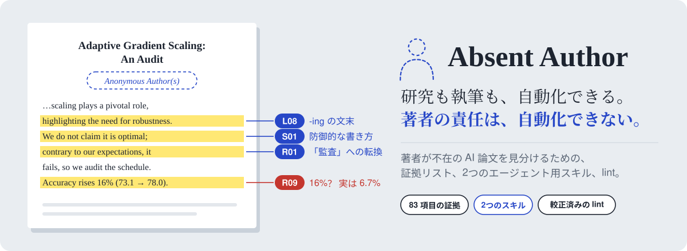

<p align="center"><picture><source media="(prefers-color-scheme: dark)" srcset="assets/banner_ja_dark.svg"></picture></p>

<p align="center"><b>AI が作り、誰も責任を負っていない研究論文を見分けるための、証拠リストと2つのエージェント用スキル。</b></p>

<p align="center">
  <a href="https://THUROI0787.github.io/absent-author/?lang=ja"></a>
  <a href="EVIDENCE.md"></a>
  <a href="#2つのスキル"></a>
  <a href="https://doi.org/10.5281/zenodo.23165721"></a>
  <a href="LICENSE"></a>
</p>

<p align="center"><b>Ruoyu Zhao</b><sup>1,*,†</sup> · <b>Zhehao Zou</b><sup>2,*</sup> · <b>Jinheng Zhang</b><sup>3</sup> · <b>Yuting Chen</b><sup>4</sup> · <b>Jiaqi Wu</b><sup>1</sup> · <b>Chenyu Zhu</b><sup>1</sup><br><sup>1</sup>City University of Hong Kong · <sup>2</sup>The Chinese University of Hong Kong · <sup>3</sup>University of Pennsylvania · <sup>4</sup>Georgia Institute of Technology<br><sub>* 同等貢献 · † プロジェクトリーダー</sub></p>

<p align="center"><a href="README.md">English</a> · <a href="README_CN.md">中文</a> · <b>日本語</b> · <a href="https://THUROI0787.github.io/absent-author/?lang=ja">ウェブサイト</a></p>

> この日本語版は [README.md](README.md) の概要です。食い違いがある場合は README.md が優先されます。証拠リスト（英語 [`EVIDENCE.md`](EVIDENCE.md)、中国語の原本 [`EVIDENCE_CN.md`](EVIDENCE_CN.md)。両者が異なる場合は中国語版が優先）、スキル本体、詳しい説明（[`docs/POSITIONING.md`](docs/POSITIONING.md)）は英語と中国語で提供しています。

いま査読者のもとには、エージェントが最初から最後まで作り上げ、誰も方向づけず、確認もせず、責任も負っていない論文が届いています。このリポジトリは、その「著者の不在」を共通の言葉で語るための出典付きの語彙と、それを査読者が引用でき、著者が直せる証拠に変えるツールを提供します。

| あなたは | 使うもの | 得られるもの |
|---|---|---|
| AI を使った論文を仕上げている**著者** | [`paper-author-pass`](skills/paper-author-pass/SKILL.md) | あなたにしか答えられない質問、主張と証拠の対応表、検証済みの参考文献と数値、そのあとで文章の推敲。最後に、署名する前に答えるべき3つの問い |
| 疑わしい投稿を前にした**査読者・AC** | [`paper-slop-screen`](skills/paper-slop-screen/SKILL.md) | W / R / Q の評価と象限、すべての指摘に該当箇所と原文、査読コメント用の段落、AC へのメモ |
| **表層だけ素早く確認**したい人 | [`tools/slop_lint.py`](tools/slop_lint.py) | 28 種類の表層の痕跡を較正済みの基準で数えた結果（人が読むための候補） |

## クイックスタート

```bash
git clone https://github.com/THUROI0787/absent-author.git && cd absent-author
./install.sh                # 2つのスキルを ~/.claude/skills へ（--project、--codex、--dest DIR、--link も可）
```

Claude Code、Codex、または `SKILL.md` を読めるエージェントで：

```text
Use paper-author-pass on paper/ in audit mode. I'll answer your questions.
Use paper-slop-screen to triage this arXiv preprint: <path or id>
```

lint は単体でも動きます（Python 3.9 以上、依存なし）：`python tools/slop_lint.py paper/ --source -o lint.md`

審査中の投稿に使う前に、投稿先の査読者向け LLM ポリシーを確認してください。ICML 2026 では、LLM を使わないと同意したのに使った査読者に関係する 497 本がデスクリジェクトされました。

## 何を検出するのか：不在の著者

**スロップとは、論文を検証するコストを査読者に押しつけることです。** 著者の不在には3つの形があります。

| 不在 | どう見えるか | 層 |
|---|---|---|
| **誰も推敲していない** | 文章が AI 主導のまま：ダッシュの多用、「X ではなく Y」、防御的な但し書き、造語、演技的な正直さ | L、一部の S |
| **誰も方向づけていない** | どの問いに価値があるか、計画が失敗したらどうするかを人間が判断していない：「監査」論文への転換、理論もどき、小さな実験に大きな主張 | R、一部の S |
| **誰も確認していない** | 最終成果物が検証されていない：存在しない参考文献、チャットの残骸、本文と表で食い違う数値 | P、R |

2つの問い（W：文章は AI 主導のまま推敲されていないか。R：研究は方向づけも検証もされていないか）で、論文は4つの象限に分かれます。通常の弱点は別の品質軸 Q に記録するので、人間が書いた出来の悪い論文がスロップと呼ばれることはありません。

<p align="center"><picture><source media="(prefers-color-scheme: dark)" srcset="assets/quadrant_dark.svg"></picture></p>

**B（立て直せる）** と **D（AI waste）** を分けるのは研究軸だけです。B には具体的な書き直しリストを渡し、文章だけを理由にリジェクトはしません。D には、誰でも検証できる欠陥にもとづいてリジェクト相当の査読コメントを書き、AC には著者が答えられる質問の形で非公開の証拠表を渡します。

## 2つのスキル

| | [`paper-author-pass`](skills/paper-author-pass/SKILL.md) | [`paper-slop-screen`](skills/paper-slop-screen/SKILL.md) |
|---|---|---|
| **対象** | 投稿前の著者 | 査読者、AC、共著者 |
| **原則** | スキルが問い、人間が決める | 証拠が先、AI 確率は出さない |
| **順序** | ストーリーと研究センス → 論証 → 検証 → 文 → 著者チェックポイント | 決定的証拠の確認 → 方向づけカード → 構成・言語・反証 → 評価 |
| **絶対のルール** | 人間の著者がいなければ監査のみ。自分の質問に自分で答えず、方向づけのない論文を磨かない（D が C になるだけ） | 公開される査読コメントに「AI 生成」と書かない。言語の証拠で研究軸を上げない |

## これは何ではないか

1. **AI 検出器ではありません。** 確率は出しません。
2. **言語だけで断定しません。** L 層の痕跡は執筆軸にのみ数えます。
3. **未熟は不在ではありません。** 初めての論文や非ネイティブの文章は、R 層か P 層の証拠と同時にある場合にだけ数えます。
4. **公開の告発ではありません。** 査読コメントには確認可能な欠陥だけを書き、出自への懸念は AC への質問として伝えます。
5. **ロンダリングの道具ではありません。** 執筆用スキルは、既定では人間の著者がいない論文を磨きません。スキルは誰でも書き換えられます。きれいな文章が通らないのは評価の仕組みのためで、言語の証拠が研究軸の評価を下げることはありません。
6. **AI に反対しているのではありません。** AI を大きく使っていても、ログ、コード、具体的な AI 使用の記述があれば、監査可能性は A+ になります。

## これからのこと

**このリストは悪用されえます。** 執筆エージェントに読み込ませ、チャットの残骸やパイプラインの透かしも含めて表層の痕跡を消すことは誰にでもできますし、既存の言い換えツールでもかなりのことができます。それでも公開するのは、文章を整えて下がるのは執筆軸の評価だけで、研究軸の評価は下がらないからです。誰も方向づけず確認もしていない論文は、せいぜい D から C に移るだけで、C こそスクリーニングが最も厳しく見る場所です。参考文献は実在するか、数値は再現するか、設計の理由を誰かが説明できるか。どんなチェックリストも、それの代わりにはなりません。言い回しで競うことは、意図してやめています。

**文章が証明できることは減っていきます。** 多くの論文にとって、執筆はもはやいちばん難しい部分ではありません。評価は、その場にいる著者にしか出せないものへ移っていくと考えています。AI 使用の開示、他人が確認できる成果物（コード、ログ、形式的証明）、そして対面で研究を擁護する力です。論文に署名する前に、AI を使ったかどうかにかかわらず、3つの問いに答えてください。

> **その論文を、隅々まで理解していますか？ 面と向かって問われても、擁護できますか？ その論文に、自分の名前を懸けられますか？**

この3つの問いは、[Harvard CMSA の Summit on PhD Math Education in the Age of AI](https://cmsa.fas.harvard.edu/media/2026/09/Summit-on-PhD-Math-Education-in-the-Age-of-AI.pdf)（2026 年 9 月）をめぐる中国語メディアの論評を翻案したものです。同サミットの報告書自体は、AI の使用は “accelerate understanding, not bypass understanding” であるべきだとしています。`paper-author-pass` は毎回の実行の最後に、あなたの論文に即したこの3種類の問いを出し、代わりに答えることはしません。

## 貢献

単語リストは古くなり、パイプラインは痕跡を消すことを覚えます。リストが役に立ち続けるのは、査読者が実際の事例を、リストが間違えた事例も含めて送り続けてくれる場合だけです。[証拠の提案](https://github.com/THUROI0787/absent-author/issues/new?template=new-evidence.yml)、[フィールドレポート](https://github.com/THUROI0787/absent-author/issues/new?template=field-report.yml)、[誤判定の報告](https://github.com/THUROI0787/absent-author/issues/new?template=false-positive.yml)は、日本語でも歓迎します。日本語訳の改善も大歓迎です。

## 著者・引用・ライセンス

| 著者 | 所属 | メール |
|---|---|---|
| Ruoyu Zhao （プロジェクトリーダー、同等貢献） | City University of Hong Kong | thuroi175007@gmail.com |
| Zhehao Zou （同等貢献） | The Chinese University of Hong Kong | zouzhehao0907@gmail.com |
| Jinheng Zhang | University of Pennsylvania | jinhengz@seas.upenn.edu |
| Yuting Chen | Georgia Institute of Technology | yuting3123@gmail.com |
| Jiaqi Wu | City University of Hong Kong | 3140610478@qq.com |
| Chenyu Zhu | City University of Hong Kong | zcy20050413@gmail.com |

Ruoyu Zhao と Zhehao Zou は同等に貢献しました。プロジェクトリーダーは Ruoyu Zhao です。Zenodo にアーカイブ済みです。引用には常に最新版を指す DOI [`10.5281/zenodo.23165721`](https://doi.org/10.5281/zenodo.23165721) をお使いください（v0.4.0 単独の DOI は [`10.5281/zenodo.23165722`](https://doi.org/10.5281/zenodo.23165722)）。参考にした先行研究・ツールへの謝辞は [README.md](README.md#acknowledgements-and-related-work) にあります。

```bibtex
@misc{absentauthor2026,
  title        = {Absent Author: Evidence and Skills for Spotting AI-Produced Papers Without a Responsible Human Author},
  author       = {Zhao, Ruoyu and Zou, Zhehao and Zhang, Jinheng and Chen, Yuting and Wu, Jiaqi and Zhu, Chenyu},
  note         = {Ruoyu Zhao and Zhehao Zou contributed equally. Project lead: Ruoyu Zhao},
  year         = {2026},
  publisher    = {Zenodo},
  doi          = {10.5281/zenodo.23165721},
  url          = {https://doi.org/10.5281/zenodo.23165721},
  howpublished = {\url{https://github.com/THUROI0787/absent-author}}
}
```

MIT ライセンスです（[`LICENSE`](LICENSE)）。
